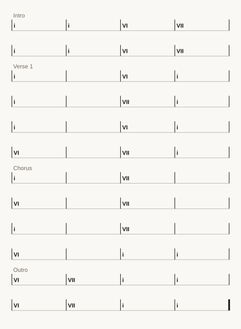

# Plainsong

Music notation you can write in any text editor, read like a lead sheet, keep in
version control, and compile to MIDI and audio.

```plainsong
[V1] (Verse - 4 Bars)
Chords: | Am . . . | F . . . | C . . . | G . . . |
Melody: | A4 . C5 E5 | F4 . A4 C5 | E4 . G4 C5 | D4 . F4 B4 |
Lyrics: | the tide  came | in  before  dawn | and  left  a | line  of  salt |
@bass   | a1 . e2 . | f1 . c2 . | c1 . g1 . | g1 . d2 . | vel: 70
```

That is the whole idea. Four rows that line up, bars separated by `|`, and a
file any editor, any diff tool and any language model can read.

**If you read music but not code**, you already understand most of that block —
it is a lead sheet with the bars drawn in. Start with
[Your first song](docs/tutorial-first-song.md); it assumes nothing about
programming and gets you to something you can hear.

**If you write code but not music**, the thing to know is that you never
declare durations. You write how many events happen in a bar and the bar divides
itself. Start with [the notation reference](docs/notation.md).

**If you are an agent**, read [AGENTS.md](AGENTS.md) first. It is short, and
most of it is the mistakes other agents have already made here.

## Try it without installing anything

`docs/demo/index.html` is a working compiler in one file — parser, arranger, MIDI
writer, a player and three interactive simulations. Save it and open it; it runs
from `file://` with no server, no build step and no network.

The simulations are there because two of this system's ideas are hard to believe
from prose. One shows a bar subdividing as you change how many events it holds.
The other puts four players and a listener on a stage you can drag: move the ear
onto the podium and the four sounds land **0 ms** apart, move it anywhere else
and they do not.

## Hello world

Python 3.10 or newer. Nothing else to install — there are no required
dependencies, and that is enforced by CI rather than merely intended.

```bash
pip install plainsong
```

Now make a piece and listen to it:

```bash
plainsong new "My First Song" -o first.song
plainsong compile first.song -o first.mid --audio first.wav --play
```

```
My First Song  --  Am, 96 bpm, 4/4
2 sections, dialect: absolute
61 notes across chords (24), melody (22), bass (15)
length 20s
midi  first.mid
audio first.wav  [builtin/python]
```

You now have a MIDI file any DAW will open and a WAV you can play anywhere. If
`--play` says it cannot find an audio player, the files were still written — open
`first.wav` however you normally would.

Open `first.song` in your editor. It is a complete, working piece, and it is the
fastest way to learn the format:

```plainsong
**TRACK: My First Song**
[MetaData]
key: Am | tempo: 96 | swing: 0% | subdivision: 8th
time: 4/4 | mood: Open

[V1] (Verse - 4 Bars)
Chords: | Am . . . | F . . . | C . . . | G . . . |
Melody: | A4 . C5 E5 | F4 . A4 C5 | E4 . G4 C5 | D4 . F4 B4 |
Lyrics: | write the words | one bar at a time | the bar divides | itself |
@bass   | a1 . e2 . | f1 . c2 . | c1 . g1 . | g1 . d2 . | vel: 70

[CH] (Chorus - 4 Bars)
Chords: | F . . . | G . . . | Am . . . | Am . . . |
Melody: | F4 . A4 C5 | G4 . B4 D5 | A4 . C5 E5 | A4 . . . |
@bass   | f1 . c2 . | g1 . d2 . | a1 . e2 . | a1 . . . | vel: 74
```

Change one chord. Recompile. Listen again. That loop is the entire workflow.

## Reading the notation

**The header.** `**TRACK:**` names the piece. `[MetaData]` sets key, tempo, time
signature and feel. Everything in it has a sensible default, so you can delete
any line you do not care about.

**Sections.** `[V1] (Verse - 4 Bars)` opens a section. The tag is yours — `V1`,
`CH`, `Bridge`, `Solo`. The parenthetical is a comment for humans; the compiler
counts the bars it actually finds.

**Rows.** A row is a voice. `Chords:`, `Melody:` and `Lyrics:` are built in, and
`@anything` is a named player — `@bass`, `@piano`, `@horns`. Rows of different
kinds sound *together*, so the four lines above are one four-bar passage played
by everybody, not sixteen bars in sequence.

**Bars and tokens.** `|` separates bars. Inside a bar, tokens are separated by
spaces and `.` means "no new note here". Pitches are scientific — `A4` is A above
middle C, `a1` an octave-and-a-bit below.

**Options** come after the last `|`: `vel: 70` sets velocity for that row.

### The one rule that surprises people

**A bar is one bar long, and the tokens inside it divide it.**

```
Chords: | Am . . . |        four tokens  -> four quarter notes
Melody: | A4 C5 E5 |        three tokens -> a triplet
Melody: | A4 . C5 . E5 . |  six tokens   -> six eighth notes
```

You do not declare durations. You write how many events happen in the bar and
the bar divides itself. Twelve tokens are triplets; a seventeenth cannot spill
into the next bar. This is why the lyric row in the starter file says *the bar
divides itself*.

If you want the older fixed-slot behaviour, set `core.bar_fill = "grid"` — it
will tell you what it had to drop.

### The other one: a column is not a promise

Every row divides its own bar, which means two rows can look aligned and not be:

```
Melody: | A4  .   C5  E5 |     four tokens -> quarters
Lyrics: | the tide came  |     three tokens -> thirds
```

`came` is written directly beneath `C5` and sounds two thirds of a beat after
it. Ask rather than assume:

```bash
plainsong lyrics song.song    # which note each syllable really lands on
```

Set `core.lyrics = "bound"` and each syllable is sung on the note it is written
under, with the barline resyncing so a miscount costs one bar instead of the
rest of the song. The default leaves existing files alone. See
[docs/lyrics.md](docs/lyrics.md).

### Two rows of the same kind run in sequence

```plainsong
[V1] (Verse - 8 Bars)
Melody: | A4 . C5 E5 | F4 . A4 C5 | E4 . G4 C5 | D4 . F4 B4 |
Melody: | C5 . E5 G5 | A4 . C5 E5 | F4 . A4 C5 | E4 . . . |
```

Two `Melody:` rows in one section are eight bars of melody, not four bars played
twice. Different kinds stack; the same kind continues.

## Building from there

Everything below works on the file you just made.

**Look at it.**

```bash
plainsong info first.song            # key, tempo, sections, bars, length
plainsong info first.song --verbose  # every diagnostic it can give you
plainsong check first.song           # is anything wrong?
```

**Move it to another key.**

```bash
plainsong transpose first.song C          # print it
plainsong transpose first.song C -o c.song # write it
plainsong transpose first.song -- -3      # or by semitones
```

Transposition moves the tonic and keeps the mode, so `Am` transposed to `C` is
`Cm`, not C major. It rewrites the chord row too, which the notation's ancestors
did not.

**Add a player.** Any `@name` row becomes its own MIDI track:

```
@horns | c4-e4-g4 . . . | f4-a4-c5 . . . | vel: 88
```

Dashes make a chord out of simultaneous pitches.

**Change the feel.** In `[MetaData]`, `swing: 62%` gives a jazz eighth-note
feel; `time: 3/4` and `6/8` work as you would expect.

**Browse the bundled library** — several thousand chord charts, across a dozen
languages:

```bash
plainsong library "waltz"
plainsong play stand-by-me
```

## Three ways in

```bash
plainsong compile song.song --play   # command line
plainsong tui                       # terminal interface
plainsong serve                     # web interface at localhost:8765
```

All three drive the same compiler and see the same library and settings. Nothing
is available in one and missing from another.

The terminal interface needs Python's `curses`, which Linux and macOS ship and
stock Python on Windows does not — `pip install windows-curses` there, or use the
web interface, which needs nothing.

## Where your files go

`plainsong compile` writes MIDI beside your `.song` file when you pass `-o`. If
you do not, it writes into the workspace instead, and tells you the full path.
`plainsong doctor` prints the locations:

```
config_file   ~/.config/plainsong/config.toml
workspace     ~/.local/share/plainsong/workspace
output_dir    ~/.local/share/plainsong/workspace/output
```

Nothing is hardcoded and nothing is written outside these unless you ask.

## What your machine can do

```bash
plainsong doctor    # what is installed, and what each missing piece would add
plainsong spec      # verify the system's promises against this machine
```

There are no required dependencies. The parser, the MIDI writer, the
synthesiser, the web interface and every model provider adapter are written
against the standard library.

**Audio.** The built-in synthesiser works with nothing installed. For higher
quality, install fluidsynth and a General MIDI soundfont — Plainsong will use
them automatically. See [docs/audio.md](docs/audio.md) for installation and
configuration.

Optional extras — NumPy for faster synthesis, ffmpeg for format conversion, mido
for hardware MIDI — are detected when present and never required.

## A chart you can put in a document

```bash
plainsong chart song.song -o chart.svg
```



That image is the SVG above, committed to this repository and embedded with an
`` tag — which is the only way a chart appears in markdown on a platform
you do not control, because GitHub strips a raw `<svg>`.

Text layout is computed in Python from a shipped width table and then declared
with `textLength`, so the chart holds its shape on a machine with none of the
fonts it names. Bars are as wide as their contents need, worked out from the
same measurements. It reads `prefers-color-scheme`, so it is legible in a dark
README as well as a light one.

See [docs/chart.md](docs/chart.md), including what it deliberately is not: a
chord chart rather than an engraver, with no noteheads, staff or beaming.

## Timing that models the room

A score usually says "this note is at beat 4.5" without saying *where* that
happens — at the player's hands, at the instrument, or at the ear it is written
for. Declare a stage and Plainsong treats written times as **arrival** times and
solves backwards for when each player has to act:

```
[Stage]
listener: conductor
@timpani: pos 4,-9  | speech: percussion
@organ:   pos 0,-14 | speech: organ-large
```

```
$ plainsong stage orchestra.song
  voice    distance  onset   travel  p-centre  act
  timpani  9.8 m     0 ms    29 ms   1 ms      -30 ms
  organ    14.0 m    140 ms  41 ms   60 ms     -241 ms

what conductor hears, against the written beat
  spread 0 ms
```

The organist's key goes down 241 ms early so the pipe speaks on the beat. At the
podium everything lands together; at any player's desk it does not, which is why
an orchestra watches rather than listens. See
[docs/performance.md](docs/performance.md).

Without a `[Stage]` block none of this applies and written times are taken at
face value, exactly as before.

## Connect a model, if you want one

The compiler does not need a model. Adding one gives you an agent that writes
and revises notation, and a build agent that adapts the install to your setup.

```bash
plainsong setup
plainsong agent "a slow waltz in D minor, piano and cello, sixteen bars"
plainsong build            # tailor this install to your machine and use case
```

It works with hosted APIs (Anthropic, OpenAI, DeepSeek, OpenRouter, Gemini, xAI,
Groq, Mistral, Together, Fireworks, Cerebras, Azure), with local servers (Ollama,
LM Studio, vLLM, llama.cpp), and with **no key at all** when you are already
running inside another agent such as Claude Code — it borrows the model that is
already there. Providers are catalogue entries rather than code, so adding one is
a JSON file. See [docs/providers.md](docs/providers.md).

Try it with no key and no network at all:

```bash
plainsong agent --provider echo "write something in D minor"
```

## Many agents, one score

`plainsong mcp` serves the whole system over the Model Context Protocol, so any
MCP-capable client can drive it without shelling out to the CLI.

```bash
plainsong mcp                 # JSON-RPC over stdio, what most clients expect
plainsong mcp --http          # loopback HTTP, for remote and multi-agent setups
plainsong mcp --list-tools    # what it exposes
```

On top of that sits an ensemble session: several agents working on one score at
once, each owning a voice. Because the parts are disjoint the common case never
conflicts, and a write made against a stale version is refused and handed the
current state to rebase onto rather than overwriting somebody.

That half of the system now has a repository of its own,
[plainsong-mcp](https://github.com/SuperInstance/plainsong-mcp), which is where
it is developed and where a client should install it from.

## Every command

| | |
|---|---|
| `compile` | notation to MIDI and audio |
| `play` | compile and play in one step |
| `new` | start a piece from a template |
| `info` | summarise a piece, with every diagnostic under `--verbose` |
| `check` | check notation, including examples inside markdown |
| `chord` / `voicing` | what a symbol means, and which notes it actually sounds |
| `chart` | draw a chord chart as SVG, for embedding in a document |
| `lyrics` | which note each syllable is sung on |
| `fingerprint` | hash what notation compiles to, so a change in the sound is visible |
| `transpose` | move a piece to another key or by semitones |
| `library` | browse the bundled notation |
| `stage` | what each listener on a stage actually hears |
| `doctor` | what this machine can do |
| `spec` | verify the system's promises |
| `providers` / `setup` | list and connect model providers |
| `config` | read and write settings |
| `agent` / `build` | the composer and build agents |
| `serve` / `tui` / `mcp` | the web, terminal and protocol interfaces |
| `bridge` | answer model requests on behalf of a host agent |

Every command takes `--json`. Use it when parsing output.

## Examples to start from

Eight complete pieces ship in the repository, written to be read rather than
generated. Each one is a template: copy it, change the chords, recompile.

```bash
plainsong compile examples/plainsong-1-creatures-of-interval.song --audio out.wav
```

| | |
|---|---|
| [Creatures of Interval](examples/plainsong-1-creatures-of-interval.song) | Four voices, plain 4/4 — the simplest complete piece |
| [The Room Is Safe](examples/plainsong-2-the-room-is-safe.song) | Lyrics and melody together |
| [Hermes Blues](examples/plainsong-3-hermes-blues.song) | Twelve-bar blues with swing |
| [Closing Time](examples/plainsong-4-closing-time.song) | The relative dialect — roman numerals and scale degrees |
| [Deck Work](examples/plainsong-5-deck-work.song) | Several named players |
| [Spacing: melody](examples/plainsong-6-spacing-melody.song) · [chords](examples/plainsong-7-spacing-chords.song) · [dashes](examples/plainsong-8-spacing-dashes.song) | How duration-by-spacing behaves |

And five deliberately awkward files in
[`examples/edge-cases/`](examples/edge-cases/) — polyrhythm, tempo shifts, dense
chords, players with no chord row, and a kitchen sink. They exist to be
compiled, not imitated.

Several thousand more chord charts ship inside the package:

```bash
plainsong library "waltz"        # search by title, key or collection
plainsong library --collections  # what is in there
plainsong play stand-by-me       # render and play by name
```

See [the songbook](docs/songbook.md) for what is in it and why it is chord
charts only.

## Documentation

| | |
|---|---|
| [For agents](AGENTS.md) | **Read this first if you are one.** The contract, and the mistakes agents make here |
| [Your first song](docs/tutorial-first-song.md) | Thirty minutes from install to a piece you wrote |
| [Arranging](docs/tutorial-arranging.md) | Several players, time signatures, and the stage model |
| [Integration](docs/integration.md) | Driving Plainsong from other software |
| [Getting started](docs/getting-started.md) | From clone to a finished piece |
| [Notation reference](docs/notation.md) | The whole language |
| [Performance timing](docs/performance.md) | Stages, arrival times, conductor directives |
| [Audio](docs/audio.md) | Rendering to WAV, MP3, and other formats; fluidsynth with soundfonts |
| [MCP server](docs/mcp.md) | Driving the system from any MCP client |
| [Ensemble sessions](docs/ensemble.md) | Several agents co-authoring one score |
| [Providers](docs/providers.md) | Connecting a model, adding your own |
| [Host bridge](docs/host-bridge.md) | Running under another agent, with no key |
| [Agents](docs/agents.md) | The composer and build agents, and their tools |
| [Chords](docs/chords.md) | Which symbols are understood, and the rules that derive the notes |
| [Voicing](docs/voicing.md) | Which notes sound when a chord names more than fit, and how that was measured |
| [Lyrics](docs/lyrics.md) | Binding syllables to the notes they are sung on, and why padding is not melisma |
| [Charts](docs/chart.md) | Drawing a chord chart as SVG, and the measurements behind it |
| [The songbook](docs/songbook.md) | The bundled charts, and the copyright policy they follow |
| [Connectors](docs/connectors.md) | Getting notation and audio into other systems |
| [Architecture](docs/architecture.md) | How it fits together, and why |
| [Specs](docs/specs.md) | The checks the system runs against itself |
| [Releasing](docs/releasing.md) | How a version is cut |
| [Contributing](CONTRIBUTING.md) | Getting involved |

## Testing

```bash
python3 -m unittest discover -s tests   # the test suite
python3 -m plainsong spec               # the system's checks on itself
python3 -m plainsong check docs examples plainsong/songbook README.md
```

CI runs all three on Python 3.10 through 3.13 across Linux, macOS and Windows
with nothing installed, which is what keeps the no-dependencies promise honest.
`check` reads the examples inside markdown as well as `.song` files, so a snippet
in the documentation that stopped compiling would fail the build.

## Relation to the fleet

| Component | Relationship |
|---|---|
| [plainsong-mcp](https://github.com/SuperInstance/plainsong-mcp) | This compiler over the Model Context Protocol, plus the ensemble session several agents share |
| [plainsong-worker](https://github.com/SuperInstance/plainsong-worker) | Cloudflare Worker version of this compiler — runs Plainsong on the edge |
| [fleet-jepa-midi](https://github.com/SuperInstance/fleet-jepa-midi) | Takes Plainsong notation as input; JEPA perceives the feel. Its conductor-directive vocabulary is the one `plainsong.perform.conduct` speaks. |
| [fleet-ensemble](https://github.com/SuperInstance/fleet-ensemble) | Renders Plainsong scores as agentic performances |

## Status

Version 1.0. The notation, the CLI surface and the provider catalogue format are
stable; changes to them will go through a deprecation cycle.

This release is a rebuild rather than an increment. The previous engine assumed a
particular machine — it wrote into a fixed home directory, required numpy, scipy,
pretty_midi and flask, and kept several copies of the General MIDI table that had
come to disagree with each other. What is here now has no required dependencies,
resolves every path at runtime, and treats model providers as catalogue entries
rather than code.

What that claim rests on: the suite runs on Python 3.10 through 3.13 across three
operating systems with nothing installed; 6,325 notation sources in this
repository compile; and `plainsong spec` checks the promises against the machine
in front of you, so you can confirm the above rather than take it on trust.

Known limits, in the open:

- The built-in synthesiser produces mono audio with synthetic timbres. It works
  immediately with no dependencies. For real instrument samples, install
  fluidsynth and a soundfont (five minutes on any OS). See
  [docs/audio.md](docs/audio.md).
- The host bridge cannot stream and reports no token usage.
- The TUI needs `curses`, which stock Python on Windows does not ship.
- No third-party MCP client has connected to the server yet; its protocol
  behaviour is verified against the specification instead.
- The bundled songbook (`plainsong/songbook/`) is **chord charts only** — melody and lyric rows were removed
  from all 6,309 files. A chord progression is not protectable expression; a tune
  and its words are, and nothing in those generated files recorded provenance.
  See [docs/songbook.md](docs/songbook.md).
- The two earlier engines are in `legacy/`, unmaintained. Nothing imports them.

## Licence

MIT. See [LICENSE](LICENSE).
