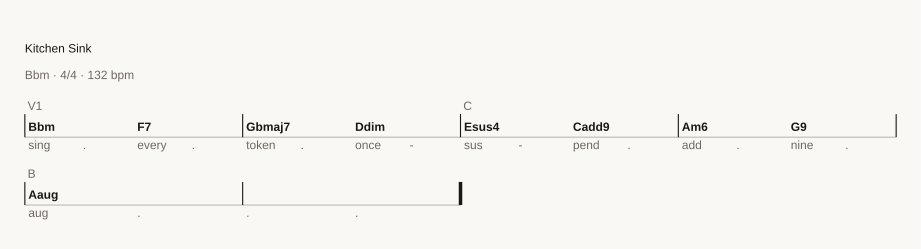

# Charts

```bash
plainsong chart song.song -o chart.svg
```

A chord chart as SVG, drawn with nothing installed. It is a standalone file, so
it commits to a repository and embeds in a document:

```markdown

```



## Why an `` and not an `<svg>`

GitHub strips a raw `<svg>` element out of markdown and renders only
``. That single fact decides most of the design, so it is worth
stating plainly rather than discovering:

- **No webfonts.** An image cannot fetch one, so the chart is drawn in whatever
  the viewer already has. See *Text that holds its width* below.
- **No script and no interactivity.** A chart is a picture.
- **The file must exist somewhere.** A path in the repository, or a URL.

The chart also carries its own background. An `` cannot inherit the host
page's colour, so a transparent chart is black ink on black in a dark README.
It does respond to `prefers-color-scheme`, which browsers honour inside an
embedded SVG, so it is legible in both themes.

## Text that holds its width

The layout is computed in Python from a shipped width table, and then each
`<text>` declares the answer with `textLength`:

```xml
<text textLength="84.03" lengthAdjust="spacingAndGlyphs">Cmaj7</text>
```

`textLength` and `lengthAdjust` are SVG *geometry*, not styling, so the browser
fits the rendered string to the width we planned for — even when it substitutes
a different font. That is what lets a chart drawn on one machine look right on
another with no font to install.

`lengthAdjust="spacingAndGlyphs"` rather than the default `spacing`, and the
reason is mechanical: `spacing` adjusts the *n−1* gaps between characters, so a
single-character symbol like `C` has no gaps to adjust and renders at whatever
width the substituted font gives it. `spacingAndGlyphs` scales the glyphs
themselves, which is the only mode that works for a one-character chord.

The widths are Liberation Sans, which is metric-compatible with **Arial**. That
is the narrowest claim the evidence supports: there was no Helvetica available
to measure, and Liberation's `M` is 833/1000 em — Arial's figure, not Adobe
Helvetica's 889. The font stack names all three anyway, because `textLength`
corrects the difference.

Regular and bold are measured separately. `m`, `b` and `j` differ between the
faces and those are exactly what chord symbols are made of; measuring one weight
and drawing the other makes `lengthAdjust` squeeze every glyph into a width the
text does not have, which looks like smeared letters.

## The flat sign is not in the font

Liberation Sans contains U+266F ♯ and does **not** contain U+266D ♭ or U+266E ♮.
That is the wrong half to lose — the bundled songbook is full of flats and the
parser accepts `E7♭9` happily.

So accidentals are folded to ASCII on the way out, whatever the source spelled:
`E7♭9` is drawn `E7b9` and `B♭` is drawn `Bb`. The command warns if anything
undrawable somehow reaches the page, which should never happen and is checked
rather than assumed.

## Bars are as wide as their contents

Having real widths is the point of measuring, so the bar width is derived from
what the bars hold. Each symbol sits at `unit × width` inside its bar, so the
one after it is clear only when `width × (next_unit − unit)` covers this
symbol's advance plus a gap. Taking the largest such requirement across the
chart gives the width exactly, with no iteration:

```
width = max over symbols of  (advance + gap) / (next_unit - unit)
```

`| Cmaj7#11 Abm7b5 Db7alt Gbmaj9 |` and `| C . . . |` therefore do not get the
same room. A fixed width either wastes most of the page or overlaps the symbols,
and which one it does depends on the song.

## Where the positions come from

Nothing here decides when a chord happens. A chord's horizontal position is
`unit × bar_width`, where `unit` is the position it already occupies in
`Arrangement.grid` — the same coordinate the MIDI writer and the lyric binder
read. A chart cannot disagree with the audio about when a chord arrives,
because it is not computing anything that could disagree.

Chord symbols are taken from **every** row, not only `Chords:`. A melody row may
legitimately carry a chord symbol, and in the relative dialect a row that mixes
roman numerals with scale degrees reads as melody — so a chart that read only
the chord row would draw a page of empty bars for a piece whose harmony is
written down perfectly plainly.

## The engraving numbers

Read from primary sources rather than recalled:

| | | |
|---|---|---|
| thin barline | 0.16 staff spaces | Bravura `thinBarlineThickness` |
| thick barline | 0.5 staff spaces | Bravura `thickBarlineThickness` |
| staff line | 0.13 staff spaces | Bravura `staffLineThickness` |
| 1 staff space | 0.25 em | SMuFL *scoring* metrics |

SMuFL defines a second figure, 0.2 em per staff space, for **text** metrics —
glyphs set inline in running prose. A chart drawn with Bravura's engraving
defaults is using the scoring registration, so it wants 0.25, and
`font-size = 4 × staff_space`.

Only the line that closes the final bar is thick. The left edge of the last bar
is an interior barline however near the end of the piece it falls.

## Options

```bash
plainsong chart song.song --bars 8          # bars per line
plainsong chart song.song --scale 10        # staff space in px; everything scales from it
plainsong chart song.song --no-lyrics       # chords only
```

`--scale` is the one number the whole drawing derives from, which is what
working in staff spaces buys.

## What this does not do yet

It is a **chord chart**, not an engraver. There are no noteheads, no stems, no
staff, and no beaming. The melody is not drawn at all — only chord symbols,
section labels, barlines and lyrics.

Also missing, and each would want its own decision:

- **Repeats and endings.** `(x2)` in a section header is understood by the
  parser and ignored here.
- **Line breaking on musical sense.** Bars per line is a fixed count rather than
  a break chosen where a section ends.
- **Font subsetting.** The chart names fonts and does not carry one, so a system
  with none of Liberation Sans, Arial or Helvetica falls back to whatever the
  generic `sans-serif` is, and `textLength` absorbs the difference.
